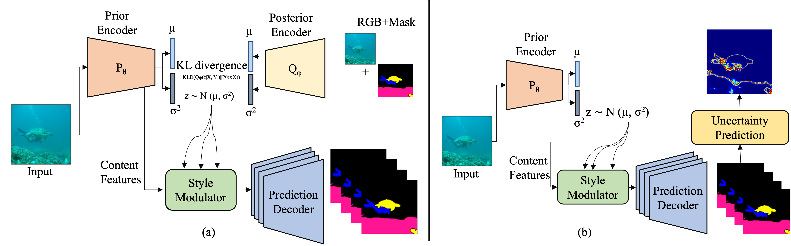

# CVAE-SM
This repository contains the code for the paper [**"CVAE-SM: A Conditional Variational Autoencoder with Style Modulation for Efficient Uncertainty Quantification."**](https://ieeexplore.ieee.org/abstract/document/10611160) The work focuses on enhancing uncertainty quantification in object segmentation, particularly within challenging underwater environments.


Illustration of the proposed framework for uncertainty quantification in underwater object segmentation. The framework is comprised of four primary modules: the Prior Encoder and Posterior Encoder generate conditional latent codes, the Style Modulator adjusts latent codes and content features, and the Decoder generates final segmentation maps. During testing, we sample latent codes from a normal distribution guided by the mean and standard deviation of the Prior encoder. This approach yields a diverse array of segmentation maps, facilitating robust uncertainty quantification.


## Prerequisites
- Python 3.9
- PyTorch 2.4.1+cu121
- Torchvision
- Albumentations
- OpenCV
- Matplotlib
- tqdm

This method was tested in:
- **GPU**: Tesla V100 GPU with 32 GB memory

## Installation 
To create a conda environment with the required packages, use the following command:
```bash
conda env create -f cvae.yml
```


## Usage
Clone the repository:
```bash
git clone https://github.com/aminullah6264/CVAE-SE.git
cd CVAE-SM
```

## Dataset
You can download the dataset used for training and testing from [Google Drive](https://drive.google.com/drive/folders/1dL5-hos6iCvAwG2qCPWT7DIbdND3y4_2?usp=sharing).
Make sure to extract the dataset and place it in the Dataset directory before running the training script.

Dataset/
├── train/
│   ├── images/
│   └── masks/
├── test/
│   ├── images/
│   ├── whole/
│   │   └── masks/
│   ├── severity_lv1/
│   ├── severity_lv2/
│   ├── severity_lv3/
│   └── severity_lv4/


## Training

To train the model with all default values, use the following command:

```bash
python train.py --DATASET_PATH ./Dataset/train \
                --SAVE_DIR ./Weights \
                --NUM_EPOCHS 120 \
                --NUM_CLASSES 5 \
                --LEARNING_RATE 1e-4 \
                --BATCH_SIZE 6 \
                --NUM_ENSEMBLES 2 
```

## Testing

```bash
python test.py --dataset_dir /nfs/stak/users/ullaham/hpc-share/RSA_Project/2023/segmentation-pytorch/test_val/ \
               --model_checkpoint ./Weights/trained_model_20240926_214052/CVAE_SE_FCN_with_Modulation_SingleGPU.pth \
               --results_dir ./Results/ \
               --num_ensembles 10

```

## Visualization

The visualization code will be uploaded shortly. Stay tuned for updates!


## Citation
If you find this code useful, please cite our paper:

@article{ullah2024cvae_sm,
  author={Ullah, Amin and Yan, Taiqing and Fuxin, Li},
  booktitle={2024 IEEE International Conference on Robotics and Automation (ICRA)}, 
  title={CVAE-SM: A Conditional Variational Autoencoder with Style Modulation for Efficient Uncertainty Quantification}, 
  year={2024},
  volume={},
  number={},
  pages={10786-10792},
  doi={10.1109/ICRA57147.2024.10611160}
  }


